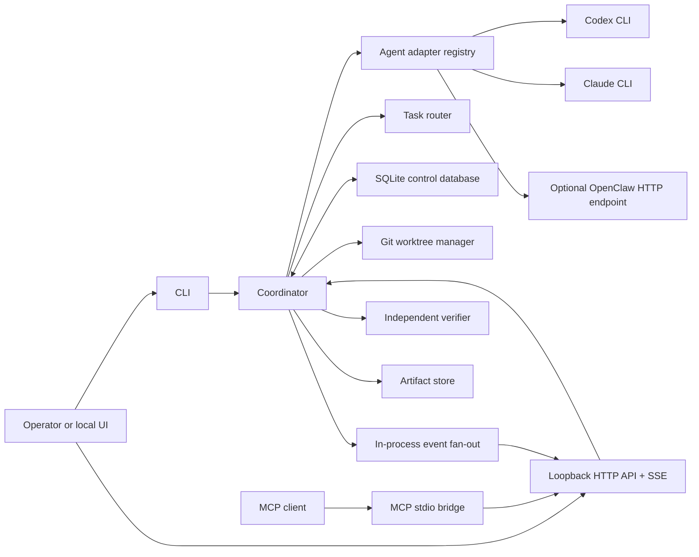
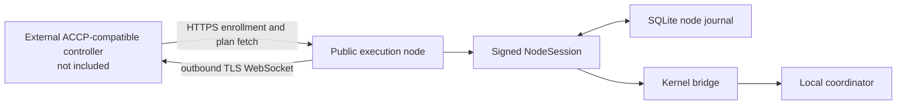

# Architecture

Agent Control Center Core is a modular local control plane. Its durable unit is a task with a route, one or more runs, evidence, messages, and review decisions. Agent output is treated as untrusted work product until explicit verification and policy gates accept it.

## Design goals

- Be useful on one developer machine without a cloud account.
- Make task state, ownership, retries, evidence, and review durable and inspectable.
- Keep agent-specific behavior behind narrow adapter contracts.
- Execute repository changes in separate Git worktrees.
- Fail closed on invalid state transitions, stale ownership, evidence mismatch, unknown schema versions, and ambiguous remote cancellation.
- Keep presentation clients outside the durable transition boundary.

The public core does not implement multi-tenant identity, billing, organization policy, a hosted web application, or the controller side of node federation.

## Local topology



### Entry points

- `acc`: creates, inspects, executes, cancels, retries, verifies, and reviews tasks.
- `acc serve`: owns the local database, optional worker loop, authenticated HTTP API, and SSE stream. It binds only to loopback hosts.
- `acc mcp`: exposes control tools and artifact resources over stdio, but sends every operation through the authenticated daemon API.
- `acc run next` and `acc run worker`: execute one queued task or continuously claim work.
- `acc node enroll` and `acc node connect`: opt this machine into an ACCP-compatible external controller. These commands are not required for local mode.

### Router and coordinator

The router converts a strict `TaskPayload` into a single, sequential, or parallel route. Explicit agent selection wins except for risk-sensitive Codex work, where independent review and an optional human-facing handoff can be added. Auto-routing currently recognizes repository implementation, architecture/review, external automation, planner-first, and high-risk change intent.

The coordinator is the transaction boundary. It validates state transitions, claims work, creates run records, persists process identity before returning from adapter start, collects results, runs verification, captures Git evidence, advances route steps, and moves the task to `needs-review`, `blocked`, `done`, or back to `queued` as appropriate.

### Durable state and live events

`ControlCenterDb` stores tasks, route steps, runs, events, artifacts, messages, reviews, and idempotency records. SQLite is the source of truth. The in-process message bus is only low-latency fan-out for SSE and other subscribers; losing a live notification does not lose its durable event.

Mutating HTTP operations require an idempotency key. A key is tied to a request fingerprint, so an identical retry can replay the stored response while a different payload using the same key fails as a conflict.

### Execution isolation and supervision

Repository tasks run in dedicated Git worktrees rooted under `ACC_HOME`. Worktrees isolate branch state; they are not containers, virtual machines, or a malware sandbox. The source repository must be a clean local Git repository, and agents still run with the operating-system permissions of the ACC process.

Local CLI adapters spawn argv directly with `shell: false`, capture stdout and stderr to bounded files, default to a 30-minute wall-clock limit, and terminate the POSIX process group on stop or timeout. The coordinator passes `ACC_CONTROL_RUN_ID` so recovery can verify process ownership before termination. Claude review uses plan/read behavior; Codex review uses a read-only sandbox mode. Execution roles permit edits within the worktree.

The verifier parses an explicit command line into argv and also spawns with `shell: false`. Verification runs after agent execution and writes a separate test-log artifact. Passing verification is evidence about that command, not proof that all possible regressions are absent.

### Evidence and review

Artifacts are stored on the local filesystem with SQLite metadata containing path, size, SHA-256, type, provenance, and task/run relationships. Typical evidence includes prompts, stdout, stderr, result summaries, diffs, Git status, commits, screenshots, verification logs, and handoffs. `acc evidence verify <task-id>` re-hashes evidence and checks storage containment.

Human review is an explicit state transition. A review decision carries optimistic-concurrency state in the HTTP API, preventing a stale browser from approving evidence that has changed underneath it.

## Optional ACCP node federation



A node generates an Ed25519 identity locally, enrolls its public key, opens an outbound WebSocket, evaluates work offers against local preconditions, and executes accepted work through the same local coordinator. The node journal persists outbound events, cursors, work-offer answers, and truncation records so reconnects can replay safely.

The controller, hosted scheduler, tenant authentication, policy service, artifact object store, and managed secrets service are deliberately absent. The public node runtime is alpha: schemas and signed envelopes cover all 24 ACCP v1 messages, while the current session state machine implements the handshake, event acknowledgements, offer decisions, review decisions, replay, and reconciliation primitives. Several controller commands are durably acknowledged but not yet fully bound to coordinator behavior; automatic heartbeat scheduling and artifact upload transport are also not complete. See the [ACCP v1 specification](reference/accp-v1.md) for the normative contract and its implementation-status appendix.

## Filesystem layout

`ACC_HOME` defaults to `.acc` resolved from the process working directory.

```text
.acc/
  control-center.sqlite       local task and evidence metadata
  control-center.sqlite-wal   SQLite WAL while active
  daemon.lock                 single-daemon lease
  daemon.token                local HTTP bearer token
  artifacts/                  immutable run evidence
  worktrees/                  isolated Git worktrees
  backups/                    pre-migration SQLite snapshots
  node/
    credentials.json          node/workspace IDs and controller public key
    key.pem                   Ed25519 private key in PKCS#8 PEM
    state.sqlite              ACCP event journal and replay state
```

`daemon.token` and `daemon.lock` are created and validated as current-user regular files with mode `0600` on POSIX. Node enrollment creates or tightens `credentials.json` and `key.pem` to mode `0600`, and identity loading rejects group- or other-readable files. The node identity is still file-backed: it is not stored in macOS Keychain, Windows Credential Manager, a TPM, or another hardware keystore. See the threat model for the remaining ownership and symlink limitations before enabling federation.

## Failure and recovery model

- A daemon lease prevents two local daemons from owning the same `ACC_HOME`; dead leases are reclaimed only after PID checks and ownership revalidation.
- Worker heartbeats identify stale ownership. Startup recovery blocks affected tasks, terminates verified local process groups, and attempts durable remote cancellation.
- An unconfirmed OpenClaw cancellation remains ambiguous; automatic retry is denied unless an operator explicitly accepts duplicate-side-effect risk.
- SQLite migrations are forward-only, transactional, backed up when user rows exist, and fail closed on a newer schema or integrity failure.
- Adapter and UI failures cannot rewrite valid state transitions. A subscriber exception is isolated from the coordinator transaction.
- ACCP reconnect creates a fresh session, advertises durable cursors, replays unacknowledged events, and reuses the saved answer for a repeated work-offer idempotency key.

## Extension boundaries

Stable architectural seams are the adapter RPC, in-process `AgentAdapter`, message bus, kernel bridge, ACCP schema bundle, node state store, and authenticated control API. A future Postgres database, durable external bus, hosted controller, or browser dashboard should integrate at these seams rather than bypassing coordinator state transitions or evidence gates.
