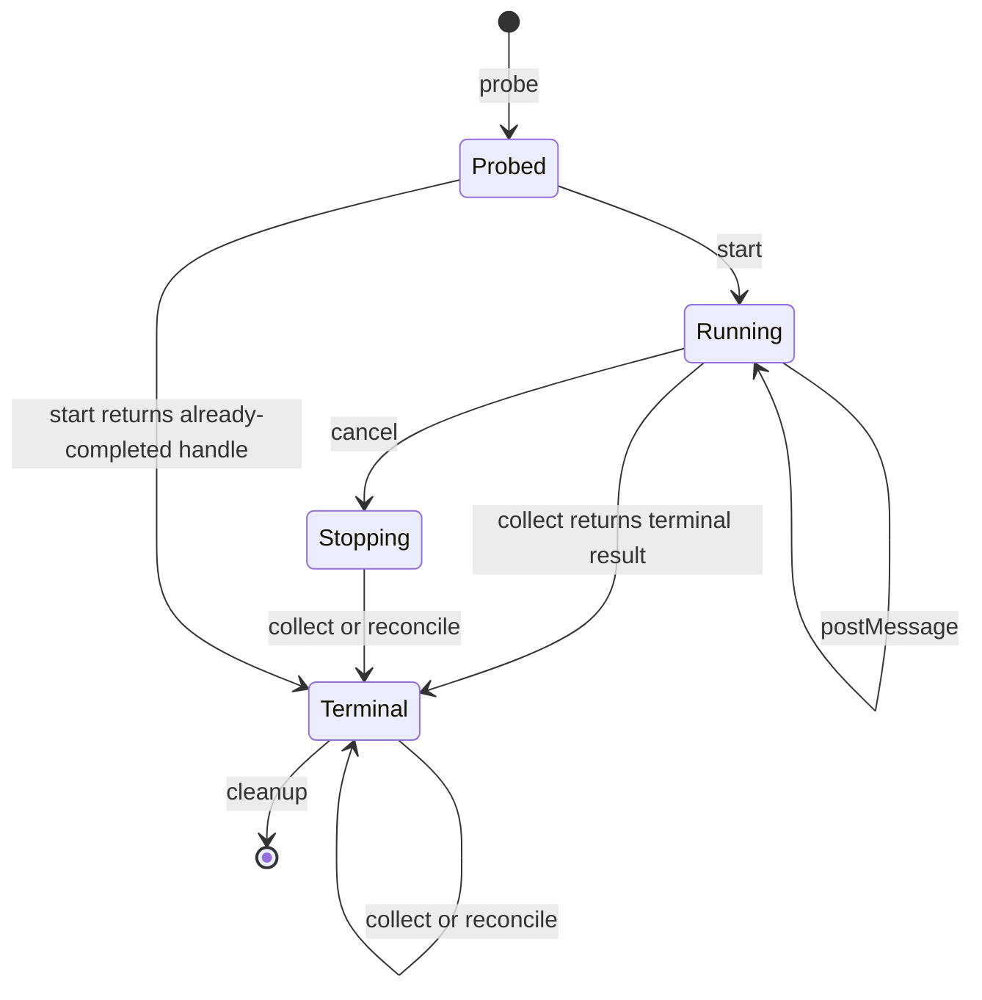

# Adapter lifecycle reference

Agent Control Center has two related adapter boundaries:

1. `AgentAdapter`, the in-process contract used by the local coordinator for the built-in Codex, Claude, and OpenClaw integrations;
2. `acc-adapter/1`, the public process RPC and manifest contract for portable third-party adapters.

The external protocol is public and has a conformance runner. Automatic discovery/registration of an arbitrary `acc-adapter/1` binary into the local built-in registry is not yet shipped; an integrator currently supplies a wrapper or registry binding after the external adapter passes conformance.

## 1. `acc-adapter/1` process protocol

An adapter is a long-running child process. It reads one JSON object per line from stdin and writes exactly one JSON response line per request to stdout. Diagnostic logs belong on stderr. The process MUST NOT write banners, progress text, or unsolicited frames to stdout.

The protocol constant is:

```text
acc-adapter/1
```

### Request

```json
{
  "protocol": "acc-adapter/1",
  "requestId": "caller-unique-id",
  "method": "probe",
  "params": {}
}
```

`requestId` is 1–200 characters. Valid methods are `probe`, `start`, `postMessage`, `collect`, `cancel`, `reconcile`, and `cleanup`. The request object is strict; unknown top-level fields are invalid.

### Success response

```json
{
  "protocol": "acc-adapter/1",
  "requestId": "caller-unique-id",
  "ok": true,
  "result": {}
}
```

### Error response

```json
{
  "protocol": "acc-adapter/1",
  "requestId": "caller-unique-id",
  "ok": false,
  "error": {
    "code": "UNSUPPORTED",
    "message": "postMessage is not supported",
    "retryable": false
  }
}
```

The response `requestId` MUST equal the request. `code` is 1–100 characters and `message` is 1–2,000 characters. `UNSUPPORTED` is REQUIRED when a capability is not declared. `NOT_FOUND`, `INVALID_REQUEST`, `IDEMPOTENCY_CONFLICT`, `UNAUTHENTICATED`, `UNAVAILABLE`, and `INTERNAL` are recommended stable codes, but the alpha response schema permits other documented codes.

## 2. Manifest

`probe` returns `{ "manifest": ... }`. The manifest is strict:

```json
{
  "protocol": "acc-adapter/1",
  "adapterId": "vendor.adapter-name",
  "displayName": "Human-readable name",
  "adapterVersion": "1.2.3",
  "capabilities": {
    "workspaceAccess": "write",
    "networkAccess": true,
    "secretNames": ["PROVIDER_TOKEN"],
    "sideEffects": "declared",
    "liveMessages": true,
    "cancellation": true,
    "reconciliation": true
  }
}
```

`adapterId` is 3–120 lowercase characters matching `[a-z0-9][a-z0-9._-]*`. Versions are opaque strings up to 64 characters; SemVer is recommended.

Capabilities are security declarations, not marketing labels:

| Capability | Meaning |
| --- | --- |
| `workspaceAccess` | `none`, `read`, or `write` access required by the adapter |
| `networkAccess` | whether execution needs outbound network access |
| `secretNames` | explicit environment/configuration secret names, at most 100 |
| `sideEffects` | `none`, only policy-declared effects, or `unrestricted` effects |
| `liveMessages` | implements `postMessage` |
| `cancellation` | implements `cancel` |
| `reconciliation` | implements `reconcile` after restart or ambiguous state |

An adapter MUST NOT understate capability. A host SHOULD deny a task when requested capability exceeds policy, and SHOULD run the adapter with only the declared files, network, and secrets.

## 3. Lifecycle



### `probe`

Returns the manifest and MUST be safe to repeat. It SHOULD perform cheap configuration/readiness checks and MUST NOT start task work.

### `start`

Parameters:

```json
{
  "task": {},
  "workingDirectory": "/absolute/worktree",
  "artifactDirectory": "/absolute/artifact-root",
  "idempotencyKey": "stable-start-key"
}
```

Success result:

```json
{
  "handleId": "adapter-owned-handle",
  "startedAt": "2026-01-01T00:00:00.000Z"
}
```

`start` MUST be idempotent. Repeating an identical semantic request with the same key returns the same `handleId` and MUST NOT launch duplicate work. Reusing a key for a different request MUST return `IDEMPOTENCY_CONFLICT`. The handle is opaque to the host and MUST remain stable through reconciliation.

An adapter MUST NOT write outside `artifactDirectory` and the workspace access declared by its manifest. Artifact paths returned later MUST resolve to children of the supplied artifact directory, not the directory itself.

### `postMessage`

Parameters are `{ "handleId": "...", "body": "..." }`. If `liveMessages` is true, the adapter MUST deliver the message at most once for a single RPC request and return success only after it has accepted responsibility. If false, it MUST return `UNSUPPORTED`.

### `collect`

Parameters are `{ "handleId": "..." }`. The current external result schema is terminal-only:

```json
{
  "handleId": "adapter-owned-handle",
  "status": "succeeded",
  "summary": "What happened",
  "artifactPaths": ["/absolute/artifact-root/result.txt"]
}
```

Status is `succeeded`, `failed`, `stopped`, or `stale`; summary is at most 100,000 characters; there are at most 200 artifact paths. `collect` SHOULD be safe to repeat and return the same terminal facts. Long-running implementations can block until terminal within the host timeout or return a documented retryable error; an explicit non-terminal result is not part of `acc-adapter/1` alpha.

### `cancel`

Parameters are `{ "handleId": "..." }`. If `cancellation` is true, the method MUST make a bounded attempt to stop the whole adapter-owned execution tree and be safe to repeat. Success means the adapter accepted responsibility for cancellation, not necessarily that terminal state is already known; the host follows with `collect` or `reconcile`. If cancellation is false, return `UNSUPPORTED`.

### `reconcile`

Parameters are `{ "handleId": "..." }` and the result uses the same terminal schema as `collect`. When `reconciliation` is true, the adapter MUST be able to recover authoritative state without relying only on volatile process memory. This is essential for remote providers and ambiguous side effects. If reconciliation is false, return `UNSUPPORTED`.

### `cleanup`

Parameters are `{ "handleId": "..." }`. Cleanup releases adapter-owned temporary state after the host has durably recorded terminal results and artifacts. It MUST be idempotent. It MUST NOT delete host-owned evidence or mutate the source workspace.

## 4. In-process `AgentAdapter`

The local coordinator uses this TypeScript lifecycle:

```ts
interface AgentAdapter {
  readonly kind: "codex" | "claude" | "openclaw";
  availability(): Promise<AdapterAvailability>;
  startTask(request: AdapterTaskRequest): Promise<AdapterRun>;
  postMessage(runId: string, message: string): Promise<void>;
  collectResult(runId: string): Promise<AdapterResult>;
  stop(runId: string): Promise<AdapterResult>;
}
```

`startTask` receives the strict task, worktree, artifact directory, route role, prompt/environment, and an `onStarted` callback. An adapter that owns a process MUST call `onStarted` after spawn but before resolving, allowing the coordinator to durably record its PID or remote handle. If persistence fails, the adapter must stop the work rather than leave an untracked run.

A terminal result includes timing, process identity, paths, exit code/signal, summary, error, and optional normalized provider usage. Unknown handles throw `AdapterRunNotFoundError`; unsupported live operations throw `AdapterCapabilityError`.

The built-in CLI supervisor uses direct argv spawning, a 30-minute default timeout, 16 MiB per output stream by default, process-group termination on POSIX, and bounded shutdown escalation. OpenClaw uses HTTPS except for local loopback, request/poll timeouts, bounded response/log bytes, and a durable remote cancellation seam.

## 5. Security and evidence rules

- stdout is protocol-only for an external adapter; logs and diagnostics go to stderr.
- Never print secret values. Secret names in the manifest are declarations, not permission to echo them.
- Do not follow artifact symlinks outside the supplied directory.
- Treat task input and workspace content as hostile. Do not interpolate them into a shell command.
- Record provider receipts and remote handles before reporting success for side-effecting operations.
- Return `stale` or an error when state cannot be proven; never manufacture a successful result.
- A summary is not evidence by itself. Put diff, test, receipt, or other verifiable material in declared artifact paths.

See [adapter conformance](../conformance/adapter.md) for the executable checks.
